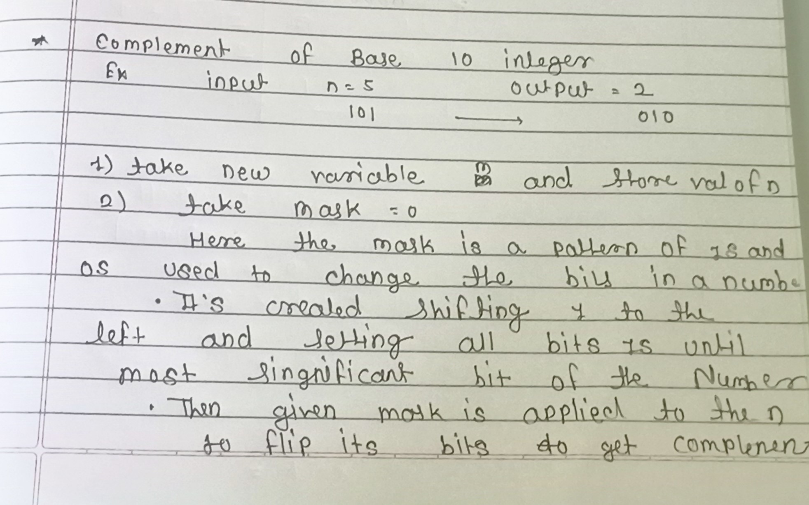

# Day 5: Number Systems and Problem Solving

## 📅 Date: 09-11-2023

## Introduction

Welcome to Day 6 of my Data Structures and Algorithms (DSA) learning journey. Today, I delved into the fascinating world of problem-solving . This day was all abouts solving Some Easy and Medium Level problem.

## Table of Contents

1. [Introduction](#introduction)
2. [What Today Learned](#📚-what-today-learned)
   - [What is Number System](#what-is-number-sysytem)

## 📚 What Today Learned

## Problem Reverse a Number

```text

Q Given a signed 32-bit integer x, return x with its digits reversed. If reversing x causes the value to go outside the signed 32-bit integer range [-231, 231 - 1], then return 0.

Assume the environment does not allow you to store 64-bit integers (signed or unsigned).

Example 1:

Input: x = 123
Output: 321
Example 2:

Input: x = -123
Output: -321
Example 3:

Input: x = 120
Output: 21
```

## Solution ==>


### Code Solution is

[1_Reverse_Number.cpp](1_Reverse_Number.cpp)

## Problem No 2 : Complement Of Base 10 Number

```
Q 1009. Complement of Base 10 Integer


The complement of an integer is the integer you get when you flip all the 0's to 1's and all the 1's to 0's in its binary representation.

For example, The integer 5 is "101" in binary and its complement is "010" which is the integer 2.
Given an integer n, return its complement.


Example 1:

Input: n = 5
Output: 2
Explanation: 5 is "101" in binary, with complement "010" in binary, which is 2 in base-10.
Example 2:

Input: n = 7
Output: 0
Explanation: 7 is "111" in binary, with complement "000" in binary, which is 0 in base-10.
Example 3:

Input: n = 10
Output: 5
Explanation: 10 is "1010" in binary, with complement "0101" in binary, which is 5 in base-10.

```

## Solution =>




### Code Solution

[2_Complement of Base 10 Integer](2_Complement_of_Base_10_Integer.cpp)

## Conclusion

In conclusion, Day 6 of my DSA learning journey focused on problem-solving, specifically tackling problems related to number systems. I successfully implemented solutions to reverse a number and find the complement of a base 10 integer. These exercises further enhanced my understanding of algorithms and logical thinking.

## 🦾 Challenges Faced

While working on today's problems, I encountered a few challenges:

- Understanding the boundary conditions for reversing a number and handling integer overflow.
- Implementing the two's complement logic for finding the complement of a base 10 integer.

Overcoming these challenges not only deepened my knowledge but also improved my problem-solving skills. I believe that facing challenges is an integral part of the learning process, and each challenge presents an opportunity for growth.

## Connect with Me

- GitHub: [](https://github.com/CoderSwarup)
- Instagram: [](https://www.instagram.com/swarup_bhise999/)

Stay tuned for more updates on my DSA learning journey!

<h3>Happy Coding 🎉</h3>
